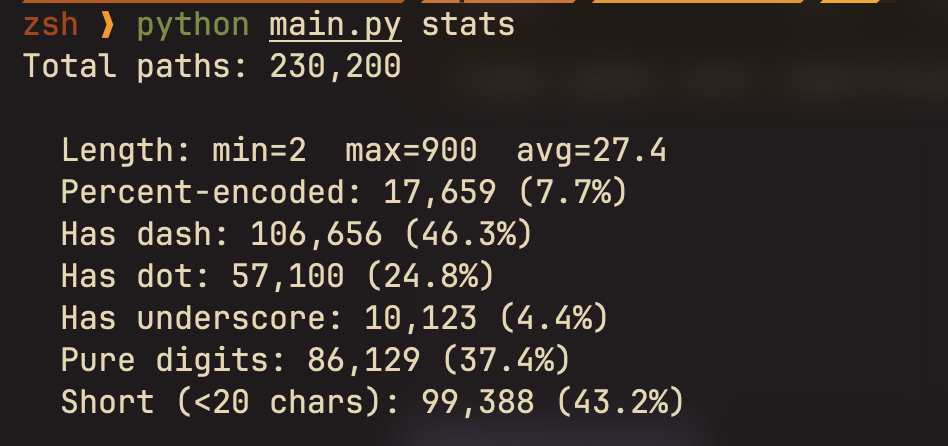
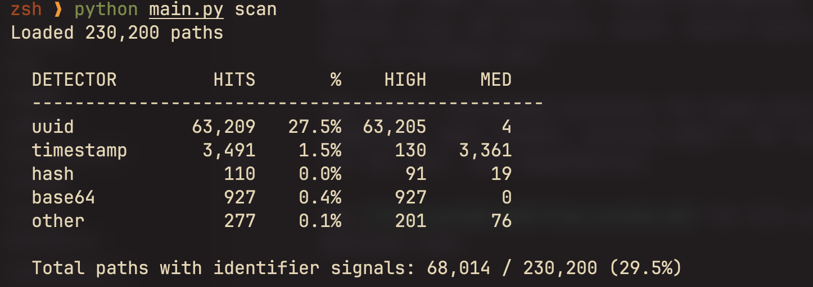

# PathKit

URL path token classifier — identifies whether a web path is a content slug, API endpoint, asset, search query, random ID, file, or encoded data.

Two layers: rule-based detectors for known patterns (UUID, timestamp, hash, base64, routing codes) + ML logistic classifier for the rest. Zero dependencies.

See [flow-system.md](flow-system.md) for full architecture and decision tree.

## Data Format

Place raw path tokens in `data/paths.txt` (one per line):

```
panduan-belajar-online
%20artikel%20guru
550e8400-e29b-41d4-a716-446655440000
/log/1718201234
```

> ⚠️ The data file must contain **only** path tokens. Remove any tool headers before use:
>
> ```bash
> grep -v "^[=\[A-Z]" raw_data.txt > data/paths.txt
> ```

## Quick Start

```bash
# Install (stdlib only, no pip needed)
# Just clone and run.

# Dataset statistics
python main.py stats

# Scan with all 5 identifier detectors
python main.py scan

# Classify a single path
python main.py detect "panduan-belajar-online"

# Run tests
python -m unittest tests.test_slugs -v

# Full pipeline (train + classify + export slugs)
python main.py classify
```

## Commands

| Command | Description |
|---|---|
| `python main.py classify` | Full pipeline: load, auto-label, train, classify, export |
| `python main.py detect <path>` | Single path through all 6 detectors + slug classifier |
| `python main.py scan` | Run all identifier detectors over full dataset |
| `python main.py stats` | Dataset shape: length, encoding, dash/dot/pure-digit ratios |
| `python -m unittest tests.test_slugs -v` | 18 integration tests |

## Results

### Dataset Stats



### Detector Scan



## Models

| Package | Detects | Score > 0.5 -> Class |
|---|---|---|
| `models/uuid` | UUIDs (8-4-4-4-12 hex+dash) | `random_id` |
| `models/timestamp` | Unix seconds/ms, ISO dates, date paths | `api` / `search` |
| `models/hash` | MD5, SHA1, SHA256, truncated hex | `asset` / `api` |
| `models/base64` | JWT/Laravel tokens (`eyJ...`), classic Base64 | `api` |
| `models/other` | Org unit codes, dotted versions, numeric IDs | `file` |
| `models/slugs` | Content slug (ML classifier, 23 features) | `slug` |

All packages expose the same API: `score(raw) -> float` and `detect_type(raw) -> str`.

### Detection Priority

```
uuid > timestamp > hash > base64 > other > slug classifier (ML)
```

If any identifier detector scores > 0.5, the ML classifier is skipped.

## Project Structure

```
PathKit/
├── main.py                  # CLI entry point
├── requirements.txt         # Zero dependencies (stdlib only)
├── README.md
├── LICENSE                  # MIT
├── .gitignore
├── data/
│   ├── paths.txt            # Input path tokens
│   └── endpoints.txt        # Input full endpoints
├── models/                  # Production packages
│   ├── slugs/               # Slug classifier (ML pipeline)
│   │   ├── classifier.py    #   URLIntentModel
│   │   ├── features.py      #   23-dim feature extraction
│   │   ├── labeling.py      #   Heuristic auto-labeler
│   │   ├── pipeline.py      #   End-to-end runner
│   │   └── constants.py
│   ├── uuid/                # UUID scoring
│   ├── timestamp/           # Timestamp scoring
│   ├── hash/                # Hash scoring
│   ├── base64/              # Base64/JWT scoring
│   └── other/               # Catch-all system artifacts
├── researchs/               # Research docs + experiments
│   ├── slug.md              # Slug detection research
│   ├── uuid.md              # UUID detection research
│   ├── timestamp.md         # Timestamp detection research
│   ├── hash.md              # Hash detection research
│   ├── base64.md            # Base64 detection research
│   ├── other.md             # Catch-all research
│   ├── uuid/                # Experiment: UUID runner + outputs
│   ├── timestamps/          # Experiment: timestamp runner + outputs
│   ├── hash/                # Experiment: hash runner + outputs
│   ├── base64/              # Experiment: base64 runner + outputs
│   └── other/               # Experiment: other runner + outputs
├── tests/
│   └── test_slugs.py        # 18 integration tests
├── weights/
│   └── slugs_v4.json        # Trained model weights
└── output/
    └── slugs/               # Pipeline exports
        ├── slugs.txt         #   High-confidence slugs
        ├── slugs_review.txt  #   Low-confidence (needs review)
        ├── slugs_with_conf.json  #   Per-slug metadata
        └── summary.json      #   Classification distribution
```
