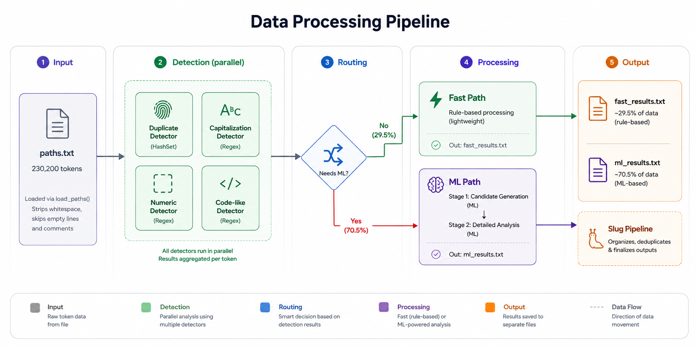

# PathKit Flow System

Full architectural flow: from raw path token to final classification.



## Detector Detail: UUID

```
score(raw) -> 0.0 to 1.0

Signals:
  +0.4  long hex-dash substring (32+ chars)
  +0.9  strict full-match UUID (8-4-4-4-12)
  +0.2  exactly 4 dashes (structural, not linguistic)
  -0.5  non-hex alpha chars (g-z, G-Z)

Contexts:
  standalone  -> random_id    (pure UUID)
  embedded    -> review        (UUID in readable text)
  asset       -> asset         (UUID + file extension)
  query       -> search        (UUID in query params)
```

## Detector Detail: Timestamp

```
score(raw) -> 0.0 to 1.0

Signals:
  +0.8  unix milliseconds (13-digit)
  +0.7  unix seconds (realistic: 1.6B-3.0B range)
  +0.7  ISO datetime (YYYY-MM-DDTHH:MM:SS)
  +0.6  date path (/YYYY/MM/DD/)
  +0.5  ISO date (YYYY-MM-DD)
  +0.3  file-style date (YYYY-MM-DD_HH-MM-SS)

Hybrid detection:
  /2026/06/12/menteri-pendidikan -> hybrid slug (still slug)
  /2026/06/12/                   -> archive listing (search)
```

## Detector Detail: Hash

```
score(raw) -> 0.0 to 1.0

Signals:
  +0.9   SHA256 (64 hex)
  +0.85  SHA1 (40 hex)
  +0.8   MD5 (32 hex)
  +0.6   generic long hex (24-128 chars)
  +0.3   truncated hex (8-16 chars, must have [a-f])
  +0.2   hex diversity bonus (>0.5 unique ratio)

Skip: UUIDs (belong to uuid detector)

Contexts:
  bundler chunk (<hash>.js/.css) -> asset
  hash embedded in text          -> review
  hash alone                     -> api
```

## Detector Detail: Base64

```
score(raw) -> 0.0 to 1.0

Signals:
  +0.9  JWT/Laravel prefix (eyJ...)
  +0.7  classic Base64 (mixed case + +/=, 30+ chars)
  +0.3  alphabet diversity (>30 unique chars)

Requires: + or / in token (pure alphanumeric is not Base64)
Requires: mixed case (upper + lower)

Contexts:
  jwt     -> api (Laravel session/CSRF token)
  classic -> api (auth/encoded data)
```

## Detector Detail: Other

```
score(raw) -> 0.0 to 1.0

Signals:
  +0.8  org unit chain (3+ =5F segments)
  +0.7  dotted version path (PREFIX###.###.###)
  +0.5  short pure numeric ID (5-10 digits)

Applied LAST — catch-all for system artifacts that survived
all other detectors.
```

## Slug Classifier Detail

### Feature Vector (23 dimensions)

| # | Feature | Range | Description |
|---|---|---|---|
| 1 | `len_norm` | 0-1 | Length / 200 |
| 2 | `has_dash` | 0/1 | Contains `-` |
| 3 | `has_underscore` | 0/1 | Contains `_` |
| 4 | `has_dot` | 0/1 | Contains `.` |
| 5 | `has_slash` | 0/1 | Contains `/` |
| 6 | `dash_ratio` | 0-1 | `-` count / length |
| 7 | `digit_ratio` | 0-1 | Digit count / length |
| 8 | `entropy_norm` | 0-1 | Shannon entropy / 8 |
| 9 | `vowel_ratio` | 0-1 | Vowels / alpha chars |
| 10 | `has_gibberish` | 0/1 | 4+ consecutive consonants |
| 11 | `token_count_norm` | 0-1 | Token count / 20 |
| 12 | `avg_token_len_norm` | 0-1 | Avg token length / 30 |
| 13 | `readable_count_norm` | 0-1 | Readable tokens / 10 |
| 14 | `common_word_hits` | 0-1 | Stopword matches / 5 |
| 15 | `anti_slug_hits` | 0-1 | System tokens / 3 |
| 16 | `token_entropy_norm` | 0-1 | Avg per-token entropy / 8 |
| 17 | `is_hex` | 0/1 | Pure hex, 8+ chars |
| 18 | `is_uuid` | 0/1 | UUID pattern match |
| 19 | `is_file_ext` | 0/1 | Known file extension |
| 20 | `is_catalog` | 0/1 | =3A or =2E encoding |
| 21 | `has_special` | 0/1 | %{}[]<> chars |
| 22 | `is_noise` | 0/1 | Short + special + no dash |
| 23 | `first_is_num` | 0/1 | First token is numeric |

### Model Architecture

```
URLIntentModel
  Classes: [slug, api, asset, search, random_id, file, encoded]
  Weights: defaultdict[str, defaultdict[str, float]]
  Bias:    defaultdict[str, float]
  LR:      0.03

  predict(raw):
    f = extract_features(raw)
    for each class:
      score = bias[class] + sum(weight[class][feat] * f[feat])
      prob = sigmoid(score)
    best = argmax(prob)
    margin = prob[best] - prob[second]
    uncertain = (prob[best] < 0.55) or (margin < 0.08)
    return {scores, final, confidence, margin, is_uncertain}

  train(raw, label, weight=1.0):
    f = extract_features(raw)
    pred = predict(raw).scores
    for each class:
      target = 1.0 if class == label else 0.0
      error = (target - pred[class]) * weight
      for feat, val in f:
        weights[class][feat] += lr * error * val
      bias[class] += lr * error
```

## Dataset Profile (22,583 paths / 447,266 endpoints)

> ⚠️ Figures below reflect the **current** dataset (22,583 paths). Earlier
> documentation cited a prior 230,200-path crawl — that is stale and removed.

```
Total paths:      22,583 (unique, 0 duplicates)
Total endpoints: 447,266 (unique, 0 duplicates)
Length:           min=2  max=766  avg=24.9
Percent-encoded:  553 (2.4%)

Identifier detector hit rates (current data):
  uuid:       ~1,000+  -> random_id
  timestamp:  ~3,500   -> api / search
  hash:       ~100     -> asset / api
  base64:     ~0       -> api
  other:      ~2,000   -> random_id / file / asset

ML classification (auto-labeled training pool, 16,404 examples):
  file:       7,860
  slug:       7,438
  asset:      1,048
  search:       47
  random_id:     8
  encoded:       3
```

See `paper/dataset.md` for the authoritative dataset manifest and split
protocol.

## Complete Classification Decision Tree

Priority order, first match wins:

| # | Detector | Condition | Result |
|---|----------|-----------|--------|
| 1 | uuid | score > 0.5 | `random_id` |
| 2 | timestamp | score > 0.5 | `api` (unix/iso), `search` (date_path), `file` (iso_date) |
| 3 | hash | score > 0.5 | `asset` (bundler), `api` (standalone), `review` (embedded) |
| 4 | base64 | score > 0.5 | `api` |
| 5 | other | score > 0.5 | `file` |
| 6 | slug classifier | all above <= 0.5 | `slug` -> post-filters -> export/review, or `file`/`random_id`/`encoded`/`search`/`asset`/`api` |
